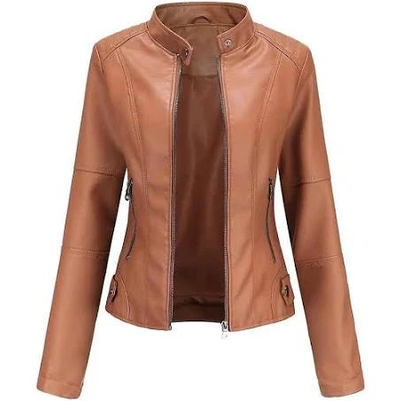
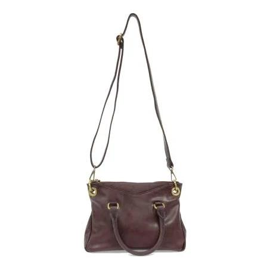

# Marqo Fashion Dataset: Model and Alpha Comparison\n\n## Reproducibility Information\n\n**Generated**: 2025-11-23T13:23:17.552116+00:00\n\n**Dataset**: `temp_marqo_data`\n**Environment**: `dev`\n**K (neighbors)**: `2`\n**Sample Index**: `0`\n**Random Seed**: `42`\n**Models**: 1\n**Alpha Values**: 1\n\n---\n\n## Query Sample\n\n**Sample Index**: 0\n\n\n\n**Query Text**:\n> Women's fitted leather jacket\n\n---\n\n## Model: `google/siglip-base-patch16-224`\n\n### Alpha = 0.500\n\n<table>\n<tr>\n<td>\n\n \n**#1** Score: 0.856 \n<small>Women's fitted leather jacket</small>\n\n</td>\n<td>\n\n \n**#2** Score: 0.764 \n<small>Convertible satchel purse</small>\n\n</td>\n</tr>\n</table>\n\n---\n\n
